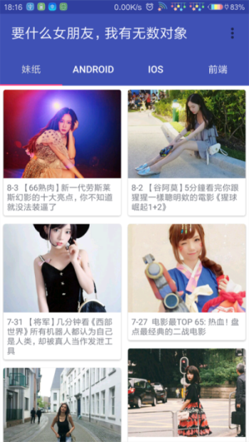
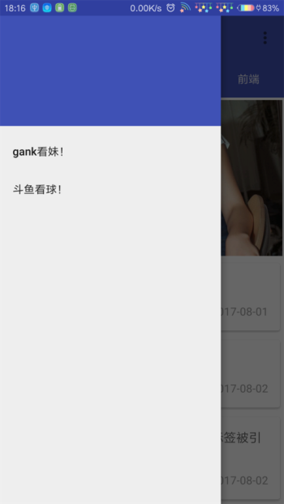

利用gank的Api做的一款练习。

------

本项目你会学习到什么：

1. MVP在实际项目中的使用以及基于MVP模式如何对项目进行目录分层；

2. 异步操作处理上，MVP+RxJava/MVP+RxJava+Retrofit的相结合；

3. BaseAdapter的使用，用的鸿洋大大的库，大大降低Adapter类的代码量；

4. BaseActivity、BaseFragment等基类的封装；

5. 对一个app基本的混淆处理；

6. 关于CoordinatorLayout+AppBarLayout+ToolBar的简单组合使用；

7. 后面想进行的关于单元测试的编写...；

   ------

   ​

### 还在开发中。。。。前期探险工作已经完成。。

### 原来图片是这么传上去的。。






=============================================================================

总结一下混淆模板：(但我的混淆在这个app里有问题，找问题中。。。)

```
#1.这是所有app都必须填写混淆规则

#代码混淆压缩比，在0-7之间，默认为5一般不需要更改
-optimizationpasses 5

#混淆时不使用大小写混合，混淆后的类名为小写
-dontusemixedcaseclassnames

#指定不去忽略非公共的库的类
-dontskipnonpubliclibraryclasses

#指定不去忽略非公共的库的类的成员
-dontskipnonpubliclibraryclassmembers

#不做预检验，preverify是proguard的4个步骤之一
#Android不需要preverify，去掉这一步可以加快混淆速度
-dontpreverify

#有了verbose这句话，混淆后就会生成映射文件，包含有类名->混淆后类名的映射关系
#然后使用printmapping指定映射文件的名称
-verbose
-printmapping proguardMapping.txt

#指定混淆时采用的算法，后面的参数是一个过滤器，一般不改变，这是谷歌推荐的算法
-optimizations !code/simplification/arithmetic,!field/,!class/merging/

#保护代码中的Annotation不被混淆
-keepattributes Annotation

#避免混淆泛型
-keepattributes Signature

#抛出异常时保留代号行号
-keepattributes SourceFile,LineNumberTable

# 保留所有的本地native方法不被混淆
-keepclasseswithmembernames class * {
    native <methods>;
}

# 所有继承自Activity/Application/Service/BroadcastReceiver
# /ContentProvider/Throwable/Exception 不要被混淆
-keep public class * extends android.app.Activity
-keep public class * extends android.support.v4.app.Fragment
-keep public class * extends android.app.Application
-keep public class * extends android.app.Service
-keep public class * extends android.content.BroadcastReceiver
-keep public class * extends android.content.ContentProvider
-keep public class * extends java.lang.Throwable {*;}
-keep public class * extends java.lang.Exception {*;}

# 保留在Activity中的方法参数是view的方法
# 从而保证我们在layout里面编写onClick就不会被影响
-keepclassmembers class * extends android.app.Activity {
   public void *(android.view.View);
}

# 枚举类不能被混淆
-keepclasseswithmembers enum * {
    public static **[] values;
    public static ** valueOf(java.lang.String);
}

# 保留自定义控件(继承自View)不能被混淆
-keep public class * extends android.view.View{
    *** get*();
    void set*(***);
    public <init>(android.content.Context);
    public <init>(android.content.Context,android.util.AttributeSet);
    public <init>(android.content.Context,android.util.AttributeSet,int);
}

# 保留Parcelable序列化的类不被混淆
-keep class * implements android.os.Parcelable{
    public static final android.os.Parcelable$Creator *;
}

# 保留Serializable序列化的类不被混淆
-keepclasseswithmembers class * implements java.io.Serializable{
    static final long serialVersionUID;
    private static final java.io.ObjectStreamField[] serialPersistentFields;
    private void writeObject(java.io.ObjectOutputStream);
    private void readObject(java.io.ObjectInputStream);
    java.lang.Object writeReplace();
    java.lang.Object readResolve();
}

# 对于R(资源)下的所有类及其方法，都不能被混淆
-keep class **.R$* {
    *;
}

# 对于带有回调函数onXXEvent的，不能被混淆
-keepclasseswithmembers class * {
    void *(**On*Event);
}
```

